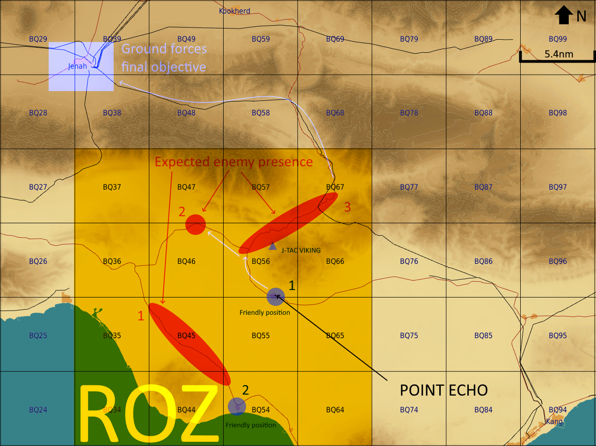
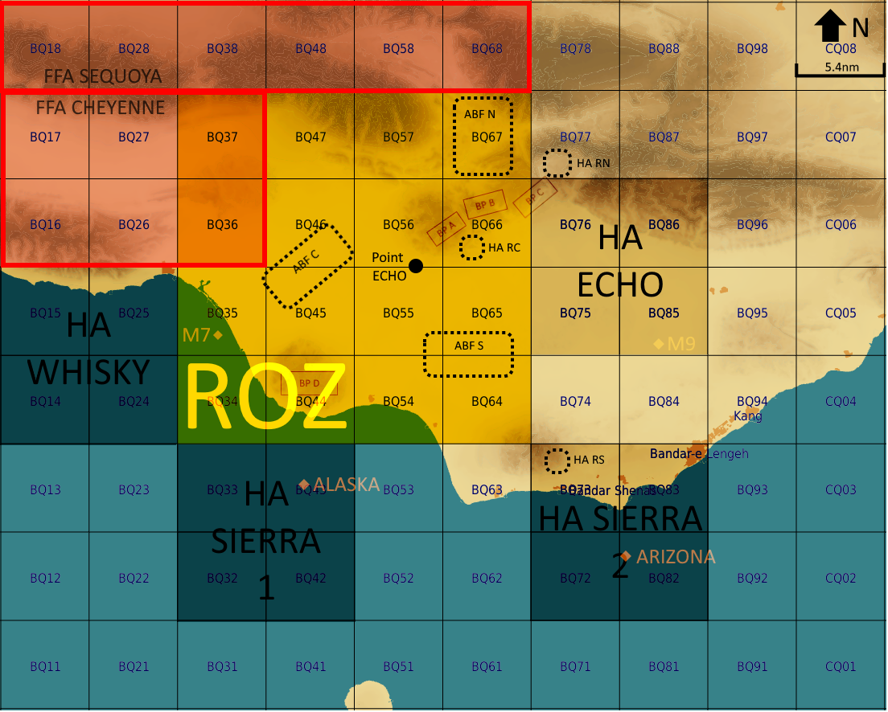

# OPUF18 CAS plan VIKING

J-TAC VIKING currently in transit to AO; situation is provisional. 

## SITUATION

### AO

ROZ GROLSCH.

AO is relatively flat to the South, with water to the South.
Northern part of the AO includes peaks at 4300 feet.

Clear skies, calm wind from EAST.

### Enemy forces

#### Composition, Disposition and Strength

* 421st Recon Company
  * based North of the AO
  * composition
    * recon soldiers
    * Land Rovers
  * attaches to other units to call air support and artillery fire
  * expected to have assets in the AO in support of ENI
* 245th Mechanized Infantry Regiment
  * based Northwest of the AO, close
  * composition
    * 24 BMP-2
    * 3 artillery units
    * support units (1 mobile CP, 2 UAZ 469 jeeps, 3 trucks)
  * very likely to operate in AO
* 123rg Motorized Infantry Regiment
  * based in JENAH
  * composition
    * 24 BTR 80
    * 3 artillery units (-)
    * support units (1 mobile CP, 2 UAZ 469 jeeps, 3 trucks)
  * will operate in AO in defense of JENAH
  * suspected conducting flanking manoeuver from the West
* 133rd Armored Regiment
  * based North of AO
  * composition
    * 24 T-72
    * 3 artillery units (-)
    * support units (1 mobile CP, 2 UAZ 469 jeeps, 3 trucks)
  * likely to operate in AO
  
## Friendly forces

### Forces on the ground

* 2 Coy (4 platoons) + artillery at village South of BQ56
* 1 platoon at village West of BQ54

### CAS mission

Ref [OPUF18 ATO](https://132nd-vwing.github.io/OPUF-Brief/Docs/ATO/ATO_18.html)

##### AXE (A-10)
CAS in support of JTAC VIKING in ROZ GROLSCH.
CP: Overhead Bandar Lenge Airport, above 10.000ft.
VUL: 1850Z-2000Z
JTAC Freq: 119.250 (RED 11) Secondary freq: 33.50 (BROWN 4)

##### CLAW (A-10)
CAS in support of JTAC VIKING in ROZ GROLSCH.
CP: Overhead Bandar Lenge Airport, above 10.000ft.
VUL: 1900Z-2010Z
JTAC Freq: 119.250 (RED 11) Secondary freq: 33.50 (BROWN 4)

##### COBRA (KA-50)
CAS in support of JTAC VIKING in ROZ GROLSCH.
CP: When airborne, out from FOB BANDAR LENGEH
VUL: 1850Z-2000Z
JTAC Freq: 119.250 (RED 11) Secondary freq: 33.50 (BROWN 4)

##### JTAC VIKING
CAS in support of planned friendly offensive in ROZ GROLSCH.
Last 24 hours, friendly forces have started their offensive toward the WEST and have captured BANDAR LENGEH. Friendly forces are preparing to continue their offensive with Close Air Support overhead.
JTAC Freq: 119.250 (RED 11) Secondary freq: 33.50 (BROWN 4)

### Mission of adjacent units

PANTHER CAP SW 65nm
SPECTRE CAP SW 95nm

### Attach/detach

nil.

## MISSION

J-TAC VIKING to provide CAS in preparation and in support of friendly advance towards JENAH (BQ39).

## EXECUTION

### Commander's intent

1. Shape the battlefield and set conditions for friendly attack.
2. Support during the attack and clear the way toward JENAH.

### Scheme of movement and manoeuver

* Phase 1: CAS to shape battlefield in rpreparation of friendly advance.
* Phase 2: friendly forces to advance towards JENAH with CAS.
 * Part of friendly forces will advance and block NW of ECHO;
 * Rest will push towards JENAH.

### CASEVAC

Casualties and downed pilots will be evacuated to FOB Bandar Lengeh by ground forces.

No DUSTOFF available.

### Coordinating instructions

All flights to report "ANNABELLE" during CAS check-in.

#### AO overview

#### Reference points

##### ECHO POINT

| Label | Coordinates              | Description           |
|-------|--------------------------|-----------------------|
| ECHO  | N 26 44.536 E 054 33.392 | village South of BQ56 |

##### FW assets

| Label       | Coordinates                     | Remarks                          |
|-------------|---------------------------------|----------------------------------|
| HA WHISKY   | center N 26 38.600 E 054 11.200 | radius 5nm, from FL1000 to FL250 |
| HA ECHO     | center N 26 44.600 E 054 47.300 | radius 5nm, from FL1000 to FL250 |
| HA SIERRA 1 | center N 26 28.000 E 054 23.500 | radius 5mn, from FL1000 to FL250 |
| HA SIERRA 2 | center N 26 28.400 E 054 47.500 | radius 5mn, from FL1000 to FL250 |
| IP M7       | N 26 40.000 E 054 20.000        |                                  |
| IP M9       | N 26 40.000 E 055 00.000        |                                  |
| IP ALASKA   | N 26 31.000 E 054 26.000        |                                  |
| IP ARIZONA  | N 26 27.000 E 054 48.000        |                                  |

##### RW assets

| Label      | Coordinates                     | Remarks                                                                                 |
|------------|---------------------------------|-----------------------------------------------------------------------------------------|
| HA RC      | N 26 45.700 E 054 40.500        | radius 5nm, from FL1000 to FL250                                                        |
| HA RS      | N 26 32.800 E 054 43.400        | radius 5nm, from FL1000 to FL250                                                        |
| BP ALPHA   | N 26 46.700 E 054 33.600        | radius 5mn, from FL1000 to FL250                                                        |
| BP BRAVO   | N 26 47.700 E 054 36.400        | radius 5mn, from FL1000 to FL250                                                        |
| BP CHARLIE | N 26 48.600 E 054 39.400        |                                                                                         |
| BP DELTA   | N 26 36.600 E 054 26.400        |                                                                                         |
| ABF C      | center N 26 44.400 E 054 26.000 | running SW - NE, [river] parallel to [dead end road]                                    |
| ABF S      | center N 26 39.000 E 054 37.300 | running W - E, SW corner northern end of [small river], E limit northern end of [river] |
| ABF N      | center N 26 53.000 E 054 37.000 | orbit [valley] BA67                                                                     |

### Risk reduction control measures

FW assets to stay FL100-FL250 when established in HAs.

RW assets to stay ground-5000ft when established in HAs/BPs/ABFs.

### Rules of engagement

FFA SEQUOYA and FFA CHEYENNE to be considered INACTIVE unless directly confirmed otherwise by and authenticated communication from VIKING or OVERLORD.

COBRA flight to conserve 40% of AGMs for popup targets.

## COMMAND AND CONTROL

### Control

J-TAC VIKING, on the hill East of BQ56.

In case J-TAC VIKING becomes unavailable, contact OVERLORD.

#### Reports

BDAs to be sent to J-TAC VIKING.

J-TAC VIKING will confirm BDA during egress and transmit consolidated BDA to C2.

Do not send BDA to In-Flight report net unless otherwise stated.

### Signal

#### Methods of communication

Same frequency for Attack and Brief.

PRIMARY: 119.250 (RED 11) 

SECONDARY: 33.50 (BROWN 4)

##### Radio ACK order

AXE CLAW COBRA.

#### Signals

2 green flares + 1 white flare: position of friendly unit on the ground.

4 red flares + 2 white: ABORT current action and re-establish last briefed holding area

#### Challenge and password

IAW with [SPINS](https://132nd-vwing.github.io/OPUF-Brief/Docs/SPINS.html) and [SPINS_18](https://132nd-vwing.github.io/OPUF-Brief/Docs/SPINS_18.html).

#### Code words

IAW with [SPINS_18](https://132nd-vwing.github.io/OPUF-Brief/Docs/SPINS_18.html).

## RFI (Request For Information)

* All FL to provide VIKING ability to extend VUL.

## Loadout

All assets to maximize loiter time.

* FW assets:
  * AGMs;
  * combat mix.
* RW assets:
  * AGMs;
  
## Threats

Small arms fire.
